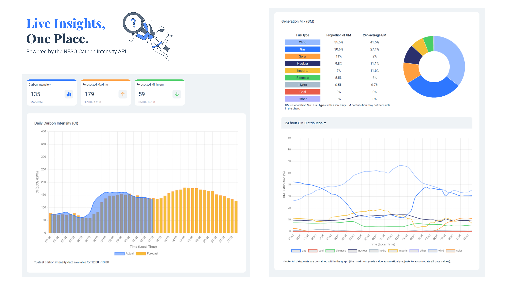
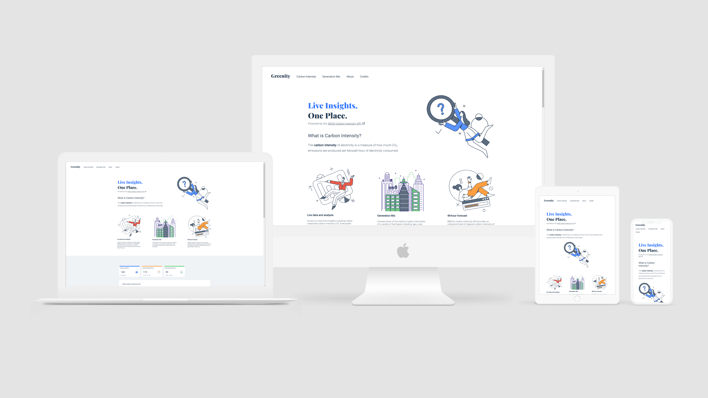

# Carbon-intensity-analyser
A web page that uses NESO's Carbon Intensity API to provide live updates and data analysis on the daily and forecasted Carbon Intensity and Generation Mix. 

## Highlights:

- Dynamic data visualisation    | Chart.JS and JavaScript
- Responsive                    | Flexible layout across different device types
- User experience               | Intuitive design, web accessibility

 

     
 

## New skills learnt:

- Using fetch() and asynchronous functions in JavaScript to request and manipulate API data.
- Using Chart.JS to create responsive and custom-styled graphs and charts.
- Using documentation to understand how to use the Chart.JS library.
- Data visualisation with JavaScript
 

 
 
Device mockup template from <a href="https://twitter.com/smailelazizi" target="_blank">@ismail</a> (<a href="https://creativecommons.org/licenses/by/4.0/" taget="blank">CC BY 4.0 license</a>)

